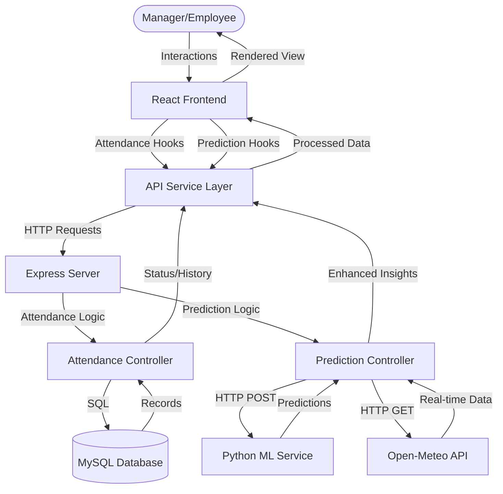

# FuelWatch: Data Flow Diagram

This document details the data lifecycle for the Attendance and AI Prediction modules.

## Architecture Overview

## Detailed Data Flows

### 1. Attendance & Shift Management
- **Flow**: User Interacts (Check-in/out) → Dashboard UI → `attendanceService` → Backend Controller → MySQL.
- **Data**: Employee info, timestamps, location coordinates, and session status recorded in the `attendance` table.

### 2. AI Demand Intelligence (ML Integration)
- **Forecast Phase**:
    1. frontend triggers `useForecast` hook.
    2. Backend `getForecast` calls the **Python ML Service** (`/predict-station-demand`).
    3. Python service uses LSTM/ARIMA models to project fuel demand.
- **Staffing Recommendation**:
    1. Backend calls ML Service (`/predict-staffing`) based on demand figures.
    2. Backend enrichment: Real-time weather data is pulled from **Open-Meteo API**.
    3. Final payload includes "Dynamic Insights" (Traffic estimates, Weather impact, ML Confidence).

### 3. Key Tech Stack
- **Frontend**: React (Vite) + React Query + Framer Motion.
- **Backend API**: Node.js (Express).
- **ML Layer**: Python (Flask) + TensorFlow/Scikit-learn.
- **Database**: MySQL.
- **External**: Open-Meteo API.
