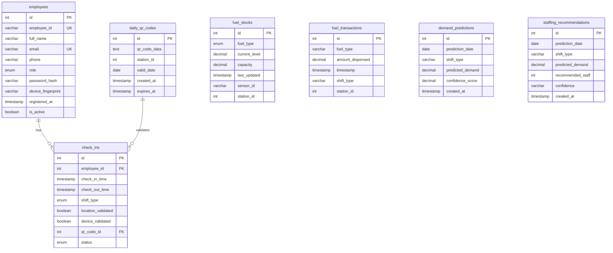

# FUELWATCH - Complete Project Documentation

> **AI-Powered Smart Surveillance & Predictive Analysis Platform for Fuel Station Management**
>
> A research project developed at SLIIT (Sri Lanka Institute of Information Technology)

---

## Table of Contents

1. [Project Overview](#project-overview)
2. [System Architecture](#system-architecture)
3. [Technology Stack](#technology-stack)
4. [Backend API (Node.js/Express)](#backend-api-nodejsexpress)
5. [Frontend Dashboard (React/Vite)](#frontend-dashboard-reactvite)
6. [ML Service (Flask/Python)](#ml-service-flaskpython)
7. [Database Schema](#database-schema)
8. [Authentication & Authorization](#authentication--authorization)
9. [Key Features](#key-features)
10. [API Reference](#api-reference)
11. [ML Models & Predictions](#ml-models--predictions)
12. [Data Pipeline](#data-pipeline)
13. [Development Setup](#development-setup)
14. [Project Structure](#project-structure)

---

## Project Overview

**FUELWATCH** is a comprehensive fuel station management platform that leverages artificial intelligence and machine learning to optimize operations. The system provides:

- **Real-time Fuel Monitoring** - Live tracking of fuel stock levels
- **AI-Powered Demand Forecasting** - Predict future fuel demand using ML models
- **Smart Staffing Recommendations** - Optimal staff allocation based on predicted demand
- **Employee Management** - Digital attendance with QR-based check-in system
- **Predictive Analytics** - Historical data analysis for strategic planning

### Research Focus Areas

| Research Area | Description |
|---------------|-------------|
| Time-Series Forecasting | LSTM and ARIMA models for demand prediction |
| Workforce Optimization | Random Forest models for staffing recommendations |
| Smart Surveillance | QR code-based employee tracking and authentication |
| IoT Integration | Sensor-based fuel level monitoring (simulated) |

---

## System Architecture

```
┌─────────────────────────────────────────────────────────────────────┐
│                         USER INTERFACE                               │
│                    Frontend (React + Vite)                           │
│                       Port: 5173                                     │
└─────────────────────────┬───────────────────────────────────────────┘
                          │ HTTP/REST
           ┌──────────────┴──────────────┐
           ▼                              ▼
┌─────────────────────┐       ┌─────────────────────┐
│   Backend API       │       │   ML Service        │
│   (Node.js/Express) │◄─────►│   (Flask/Python)    │
│   Port: 5000        │       │   Port: 5001        │
└─────────┬───────────┘       └─────────────────────┘
          │                              │
          ▼                              ▼
┌─────────────────────┐       ┌─────────────────────┐
│   MySQL Database    │       │   Trained Models    │
│   fuelwatch_db      │       │   (LSTM, ARIMA, RF) │
└─────────────────────┘       └─────────────────────┘
```

### Service Communication

| From | To | Protocol | Purpose |
|------|-----|----------|---------|
| Frontend | Backend | HTTP REST | CRUD operations, Authentication |
| Frontend | ML Service | HTTP REST | Direct predictions (optional) |
| Backend | ML Service | HTTP REST | Demand & staffing predictions |
| Backend | MySQL | TCP | Data persistence |

---

## Technology Stack

### Backend

| Component | Technology | Version |
|-----------|------------|---------|
| Runtime | Node.js | 16+ |
| Framework | Express.js | 4.18+ |
| Database | MySQL | 8.0+ |
| ORM/Driver | mysql2 | 3.6+ |
| Authentication | JWT | 9.0+ |
| Password Hashing | bcryptjs | 2.4+ |
| Validation | express-validator | 7.0+ |
| QR Code | qrcode | 1.5+ |
| HTTP Client | axios | 1.13+ |
| CORS | cors | 2.8+ |

### Frontend

| Component | Technology | Version |
|-----------|------------|---------|
| Framework | React | 18.2+ |
| Build Tool | Vite | 7.2+ |
| Styling | Tailwind CSS | 3.4+ |
| Routing | React Router DOM | 7.9+ |
| Charts | Recharts | 3.5+ |
| Animations | Framer Motion | 12.23+ |
| Icons | Lucide React | 0.554+ |
| QR Scanner | html5-qrcode | 2.3+ |
| Date Utils | date-fns | 4.1+ |

### ML Service

| Component | Technology | Version |
|-----------|------------|---------|
| Framework | Flask | 3.0+ |
| Deep Learning | TensorFlow/Keras | Latest |
| Statistical ML | Statsmodels | Latest |
| Machine Learning | Scikit-learn | Latest |
| Data Processing | Pandas, NumPy | Latest |
| CORS | flask-cors | 4.0+ |

---

## Backend API (Node.js/Express)

### Directory Structure

```
backend/
├── config/
│   └── db.js                 # MySQL connection configuration
├── controllers/
│   ├── authController.js     # User authentication
│   ├── employeeController.js # Employee CRUD operations
│   ├── attendanceController.js # Attendance management
│   ├── checkinController.js  # Check-in/check-out logic
│   ├── fuelStockController.js # Fuel stock operations
│   ├── predictionController.js # ML service integration
│   └── qrController.js       # QR code generation
├── middleware/
│   └── authMiddleware.js     # JWT verification
├── models/
│   ├── Employee.js           # Employee data model
│   ├── CheckIn.js            # Check-in records model
│   ├── DailyQR.js            # Daily QR code model
│   └── FuelStock.js          # Fuel stock model
├── routes/
│   ├── auth.js               # /api/auth/*
│   ├── employee.js           # /api/employees/*
│   ├── attendance.js         # /api/attendance/*
│   ├── checkin.js            # /api/checkin/*
│   ├── fuelStock.js          # /api/fuel/*
│   ├── prediction.js         # /api/predictions/*
│   └── qr.js                 # /api/qr/*
├── .env                      # Environment configuration
├── server.js                 # Main application entry
└── package.json              # Dependencies
```

### Controllers

#### 1. authController.js
Handles user authentication and registration.

| Function | Purpose |
|----------|---------|
| `register` | Create new user account |
| `login` | Authenticate user, return JWT token |

#### 2. employeeController.js
Manages employee CRUD operations.

| Function | Purpose |
|----------|---------|
| `getAllEmployees` | Retrieve all employees |
| `getEmployeeById` | Get single employee details |
| `updateEmployee` | Update employee information |
| `deleteEmployee` | Remove employee from system |

#### 3. attendanceController.js
Manages attendance records and reporting.

| Function | Purpose |
|----------|---------|
| `getAttendanceRecords` | Retrieve attendance history |
| `recordAttendance` | Create attendance entry |
| `getAttendanceReport` | Generate attendance report |

#### 4. checkinController.js
Handles QR-based check-in/check-out.

| Function | Purpose |
|----------|---------|
| `checkIn` | Process employee check-in |
| `checkOut` | Process employee check-out |
| `validateQR` | Verify QR code validity |

#### 5. fuelStockController.js
Monitors and updates fuel stock levels.

| Function | Purpose |
|----------|---------|
| `getAllStocks` | Get all fuel stock levels |
| `updateStock` | Update fuel level |

#### 6. predictionController.js
Integrates with ML service for predictions.

| Function | Purpose |
|----------|---------|
| `getDemandPrediction` | Get fuel demand forecast |
| `getStaffingPrediction` | Get staffing recommendations |
| `getStationDemand` | Get total station demand |

#### 7. qrController.js
Generates and manages daily QR codes.

| Function | Purpose |
|----------|---------|
| `generateDailyQR` | Create daily QR code |
| `getDailyQR` | Retrieve current QR code |

### Environment Variables

```env
PORT=5000
DB_HOST=localhost
DB_USER=root
DB_PASSWORD=your_password
DB_NAME=fuelwatch_db
JWT_SECRET=your_jwt_secret
ML_SERVICE_URL=http://localhost:5001
```

---

## Frontend Dashboard (React/Vite)

### Directory Structure

```
frontend/
├── public/
│   └── vite.svg
├── src/
│   ├── assets/               # Static assets
│   ├── components/           # Reusable components
│   │   ├── Navbar.jsx
│   │   ├── EmployeeCard.jsx
│   │   ├── ExpandableFuelGrid.jsx
│   │   ├── LiveStockCard.jsx
│   │   ├── PredictionChart.jsx
│   │   ├── QRCodeDisplay.jsx
│   │   └── StaffingRecommendation.jsx
│   ├── pages/                # Page components
│   │   ├── Login.jsx
│   │   ├── Dashboard.jsx
│   │   ├── EmployeeRegistration.jsx
│   │   ├── MobileCheckIn.jsx
│   │   └── LiveStockDemo.jsx
│   ├── tabs/                 # Dashboard tabs
│   │   ├── EmployeeDetailsTab.jsx
│   │   ├── LiveStocksTab.jsx
│   │   └── PredictionsTab.jsx
│   ├── services/             # API service layer
│   ├── utils/                # Utility functions
│   ├── App.jsx               # Main component
│   ├── App.css               # App styles
│   ├── index.css             # Global styles
│   └── main.jsx              # Entry point
├── index.html
├── vite.config.js
├── tailwind.config.js
└── package.json
```

### Routing Structure

| Route | Component | Access | Description |
|-------|-----------|--------|-------------|
| `/login` | Login.jsx | Public | User login page |
| `/dashboard` | Dashboard.jsx | Protected | Main dashboard with tabs |
| `/register-employee` | EmployeeRegistration.jsx | Protected (Manager) | Register new employees |
| `/mobile-checkin` | MobileCheckIn.jsx | Protected | QR code check-in |
| `/` | Redirect | - | Redirects to /dashboard |

### Key Components

#### Pages

| Component | Purpose |
|-----------|---------|
| `Login.jsx` | User authentication interface |
| `Dashboard.jsx` | Main dashboard with navigation tabs |
| `EmployeeRegistration.jsx` | Employee onboarding form |
| `MobileCheckIn.jsx` | QR code scanner for check-in/out |
| `LiveStockDemo.jsx` | Real-time fuel stock demonstration |

#### Dashboard Tabs

| Tab | Component | Features |
|-----|-----------|----------|
| Employee Details | `EmployeeDetailsTab.jsx` | View, edit, delete employees |
| Live Stocks | `LiveStocksTab.jsx` | Real-time fuel level monitoring |
| Predictions | `PredictionsTab.jsx` | AI demand forecasts & staffing |

#### Reusable Components

| Component | Purpose |
|-----------|---------|
| `Navbar.jsx` | Navigation bar with role-based menu |
| `EmployeeCard.jsx` | Employee information display card |
| `ExpandableFuelGrid.jsx` | Interactive fuel stock grid |
| `LiveStockCard.jsx` | Individual fuel type stock display |
| `PredictionChart.jsx` | Demand forecast visualization |
| `QRCodeDisplay.jsx` | QR code renderer |
| `StaffingRecommendation.jsx` | AI staffing recommendations display |

---

## ML Service (Flask/Python)

### Directory Structure

```
ml-service/
├── models/                    # ML model definitions
├── saved_models/              # Trained model files
│   ├── lstm_model.h5          # LSTM deep learning model
│   ├── lstm_scaler_X.pkl      # Feature scaler
│   ├── lstm_scaler_y.pkl      # Target scaler
│   ├── arima_model.pkl        # ARIMA time series model
│   ├── random_forest_model.pkl # RF staffing model
│   ├── rf_features.pkl        # RF feature names
│   ├── station_demand_model.pkl # Historical averages model
│   └── station_rf_model.pkl   # Station staffing model
├── utils/                     # Utility functions
├── app.py                     # Main Flask application
├── generate_dataset.py        # Synthetic data generator
├── train_models.py            # Full training pipeline
├── train_demand_model.py      # Station demand training
├── train_station_model.py     # Station staffing training
├── test_ml_service.py         # API tests
├── requirements.txt           # Python dependencies
├── fuelwatch_synthetic_dataset.csv
├── fuelwatch_sample_1000.csv
└── dataset_summary.json
```

### ML Models

#### 1. LSTM Model (Deep Learning)

| Property | Value |
|----------|-------|
| **Purpose** | Time-series demand forecasting |
| **File** | `saved_models/lstm_model.h5` |
| **Architecture** | LSTM(128) → Dropout → LSTM(64) → Dropout → Dense(32) → Dense(1) |
| **Sequence Length** | 7 days lookback |
| **Features** | 11 (day, month, weekend, holiday, temp, rain, seasonal, shift, lags, rolling mean) |

#### 2. ARIMA Model (Statistical)

| Property | Value |
|----------|-------|
| **Purpose** | Statistical time-series forecasting |
| **File** | `saved_models/arima_model.pkl` |
| **Parameters** | (p=5, d=1, q=2) |
| **Use Case** | Fallback when LSTM unavailable |

#### 3. Random Forest Model (Staffing)

| Property | Value |
|----------|-------|
| **Purpose** | Staff recommendation |
| **File** | `saved_models/random_forest_model.pkl` |
| **Estimators** | 100 trees |
| **Max Depth** | 10 |
| **Output Range** | 2-5 staff members |
| **Features** | 9 (demand, transactions, wait_time, day, weekend, holiday, shift, temp, seasonal) |

#### 4. Station Demand Model

| Property | Value |
|----------|-------|
| **Purpose** | Total station demand prediction |
| **File** | `saved_models/station_demand_model.pkl` |
| **Method** | Historical averages by day-of-week |
| **Type** | Lookup Table (Dictionary) |

### Model Performance Metrics

| Model | MAE | RMSE | R² Score | MAPE |
|-------|-----|------|----------|------|
| LSTM | ~45L | ~58L | ~0.92 | ~3.5% |
| ARIMA | ~60L | ~78L | ~0.85 | ~4.8% |
| Random Forest (Staffing) | ~0.15 | ~0.22 | ~0.95 | N/A |

### API Endpoints

| Endpoint | Method | Purpose |
|----------|--------|---------|
| `/health` | GET | Service health check |
| `/predict-demand` | POST | Fuel demand prediction |
| `/predict-staffing` | POST | Staffing recommendation |
| `/predict-station-demand` | POST | Total station demand |
| `/batch-predict` | POST | Multiple predictions |
| `/models/info` | GET | Model information |
| `/models/reload` | POST | Reload all models |

---

## Database Schema

### Database: `fuelwatch_db`



### Tables Summary

| Table | Purpose | Key Fields |
|-------|---------|------------|
| `employees` | Employee records & credentials | employee_id, role, password_hash |
| `daily_qr_codes` | Daily QR codes for check-in | qr_code_data, valid_date |
| `check_ins` | Attendance records | employee_id, shift_type, status |
| `fuel_stocks` | Fuel level monitoring | fuel_type, current_level, capacity |
| `fuel_transactions` | Fuel dispensing records | amount_dispensed, timestamp |
| `demand_predictions` | AI demand forecasts | predicted_demand, confidence_score |
| `staffing_recommendations` | AI staffing suggestions | recommended_staff, confidence |

---

## Authentication & Authorization

### Authentication Flow


### Role-Based Access Control

| Feature | Attendant | Supervisor | Manager |
|---------|:---------:|:----------:|:-------:|
| Check-in/Check-out | ✅ | ✅ | ✅ |
| View own attendance | ✅ | ✅ | ✅ |
| View all attendance | ❌ | ✅ | ✅ |
| View predictions | ❌ | ✅ | ✅ |
| View fuel stocks | ❌ | ✅ | ✅ |
| Manage employees | ❌ | ❌ | ✅ |
| Generate reports | ❌ | ✅ | ✅ |

### Protected Routes

All the following routes require a valid JWT token:
- `/api/employees/*`
- `/api/fuel/*`
- `/api/predictions/*`
- `/api/attendance/*`
- `/api/qr/*`
- `/api/checkin/*`

---

## Key Features

### 1. Employee Management

- **Digital Registration** - Onboard employees with role assignment
- **Profile Management** - View, edit, and delete employee records
- **Device Fingerprinting** - Secure device-based authentication
- **Role-Based Access** - Attendant, Supervisor, Manager roles

### 2. Smart Check-In System


- **Daily Rotating QR Codes** - Fresh QR codes generated daily
- **Location Validation** - Verify employee is on-site
- **Device Validation** - Match registered device fingerprint
- **Shift Tracking** - Morning, Afternoon, Evening shifts

### 3. Fuel Stock Monitoring

- **Real-time Tracking** - Live fuel level updates
- **Multiple Fuel Types** - Petrol 92, Petrol 95, Diesel, Super Diesel
- **IoT Integration** - Sensor-based monitoring (simulated)
- **Low Stock Alerts** - Notifications for reorder triggers

### 4. AI-Powered Predictions


- **Fuel Demand Forecasting** - Predict daily/shift-based demand
- **Staffing Recommendations** - Optimal staff allocation
- **7-Day Forecasts** - Weekly demand predictions
- **Confidence Scoring** - Reliability metrics for predictions

### 5. Dashboard Analytics

- **Live Visualizations** - Real-time fuel stock charts
- **Prediction Graphs** - Demand forecast trends
- **Employee Statistics** - Attendance and performance metrics
- **Interactive UI** - Modern, responsive design

---

## API Reference

### Authentication

#### Register New User
```http
POST /api/auth/register
Content-Type: application/json

{
  "full_name": "John Doe",
  "email": "john@example.com",
  "phone": "0712345678",
  "role": "attendant",
  "password": "securepassword"
}
```

#### Login
```http
POST /api/auth/login
Content-Type: application/json

{
  "email": "john@example.com",
  "password": "securepassword"
}
```

**Response:**
```json
{
  "token": "eyJhbGciOiJIUzI1NiIs...",
  "user": {
    "id": 1,
    "employee_id": "EMP001",
    "full_name": "John Doe",
    "role": "attendant"
  }
}
```

### Employees

#### Get All Employees
```http
GET /api/employees
Authorization: Bearer <token>
```

#### Get Employee by ID
```http
GET /api/employees/:id
Authorization: Bearer <token>
```

#### Update Employee
```http
PUT /api/employees/:id
Authorization: Bearer <token>
Content-Type: application/json

{
  "full_name": "John Smith",
  "phone": "0719876543"
}
```

#### Delete Employee
```http
DELETE /api/employees/:id
Authorization: Bearer <token>
```

### Fuel Stocks

#### Get All Fuel Stocks
```http
GET /api/fuel/stocks
Authorization: Bearer <token>
```

**Response:**
```json
[
  {
    "id": 1,
    "fuel_type": "petrol",
    "current_level": 8500.50,
    "capacity": 10000.00,
    "last_updated": "2024-12-07T08:00:00Z"
  }
]
```

### Predictions

#### Get Demand Prediction
```http
POST /api/predictions/demand
Authorization: Bearer <token>
Content-Type: application/json

{
  "date": "2024-12-07",
  "shift": "morning"
}
```

**Response:**
```json
{
  "predicted_demand": 1650.25,
  "confidence": 0.88,
  "model": "LSTM v1.0",
  "factors": {
    "seasonal_factor": 1.15,
    "shift_multiplier": 1.3,
    "is_weekend": false
  }
}
```

#### Get Staffing Recommendation
```http
POST /api/predictions/staffing
Authorization: Bearer <token>
Content-Type: application/json

{
  "predicted_demand": 1650
}
```

**Response:**
```json
{
  "recommended_staff": 4,
  "confidence": "high",
  "expected_wait_time": "5 minutes"
}
```

---

## ML Models & Predictions

### Prediction Flow


### Feature Engineering

#### Lag Features
```python
demand_lag_1   = demand from 1 day ago
demand_lag_7   = demand from 7 days ago
demand_lag_30  = demand from 30 days ago
```

#### Rolling Statistics
```python
demand_rolling_mean_7 = 7-day rolling average
demand_rolling_std_7  = 7-day rolling standard deviation
```

#### Cyclical Encoding
```python
day_sin   = sin(2π × day_of_week / 7)
day_cos   = cos(2π × day_of_week / 7)
month_sin = sin(2π × month / 12)
month_cos = cos(2π × month / 12)
```

### Shift & Seasonal Multipliers

| Factor | Morning | Afternoon | Evening |
|--------|---------|-----------|---------|
| Shift Multiplier | 1.3 | 1.0 | 0.85 |

| Factor | Weekday | Weekend | Holiday |
|--------|---------|---------|---------|
| Day Multiplier | 1.0 | 1.25 | 1.6 |

### Fallback Mechanisms

When ML models are unavailable:

```python
# Demand Fallback
base_demand = 1500
seasonal_factor = sin-based monthly adjustment
shift_multiplier = morning(1.3), afternoon(1.0), evening(0.85)
weekend_multiplier = 1.25 if weekend else 1.0
demand = base_demand × seasonal × shift × weekend + noise

# Staffing Fallback
staff = max(2, min(5, int(demand / 500) + 1))
```

---

## Data Pipeline

### Synthetic Dataset Generation


### Dataset Configuration

| Parameter | Value |
|-----------|-------|
| Date Range | 2022-01-01 to 2024-12-31 |
| Fuel Types | Petrol_92, Petrol_95, Diesel, Super_Diesel |
| Shifts | morning, afternoon, evening |
| Stations | Station_A through Station_E |
| Total Records | ~657,600 records |

---

## Development Setup

### Prerequisites

- **Node.js** v16+
- **Python** v3.8+
- **MySQL** v8.0+
- **npm** or **yarn**
- **pip** (Python package manager)

### Quick Start

#### 1. Clone Repository
```bash
git clone <repository-url>
cd Research-Project-SLIIT
```

#### 2. Database Setup
```bash
mysql -u root -p
source database/schema.sql
```

#### 3. Backend Setup
```bash
cd backend
npm install
# Configure .env file (see Environment Variables section)
npm run dev
```

#### 4. Frontend Setup
```bash
cd frontend
npm install
npm run dev
```

#### 5. ML Service Setup
```bash
cd ml-service
pip install -r requirements.txt
python app.py
```

### Access Points

| Service | URL |
|---------|-----|
| Frontend | http://localhost:5173 |
| Backend API | http://localhost:5000 |
| ML Service | http://localhost:5001 |

### Seeding Data

```bash
cd backend

# Seed admin user
node seedAdmin.js

# Seed employees
node seedSampleData.js

# Seed fuel stocks
node seedFuelStocks.js

# Seed attendance records
node seedAttendance.js

# Seed check-in records
node seedCheckIns.js
```

### Training ML Models

```bash
cd ml-service

# Generate synthetic dataset (if not exists)
python generate_dataset.py

# Train all models
python train_models.py

# Train specific models
python train_demand_model.py     # Station demand
python train_station_model.py    # Station staffing
```

---

## Project Structure

```
Research-Project-SLIIT/
├── backend/                      # Node.js/Express Backend
│   ├── config/                   # Database configuration
│   │   └── db.js
│   ├── controllers/              # Business logic
│   │   ├── attendanceController.js
│   │   ├── authController.js
│   │   ├── checkinController.js
│   │   ├── employeeController.js
│   │   ├── fuelStockController.js
│   │   ├── predictionController.js
│   │   └── qrController.js
│   ├── middleware/               # Express middleware
│   │   └── authMiddleware.js
│   ├── models/                   # Data models
│   │   ├── CheckIn.js
│   │   ├── DailyQR.js
│   │   ├── Employee.js
│   │   └── FuelStock.js
│   ├── routes/                   # API routes
│   │   ├── attendance.js
│   │   ├── auth.js
│   │   ├── checkin.js
│   │   ├── employee.js
│   │   ├── fuelStock.js
│   │   ├── prediction.js
│   │   └── qr.js
│   ├── .env                      # Environment variables
│   ├── package.json
│   └── server.js                 # Main server
│
├── frontend/                     # React/Vite Frontend
│   ├── public/
│   ├── src/
│   │   ├── assets/
│   │   ├── components/           # UI components
│   │   ├── pages/                # Page components
│   │   ├── services/             # API services
│   │   ├── tabs/                 # Dashboard tabs
│   │   ├── utils/                # Utilities
│   │   ├── App.jsx
│   │   └── main.jsx
│   ├── index.html
│   ├── package.json
│   ├── tailwind.config.js
│   └── vite.config.js
│
├── ml-service/                   # Flask ML Service
│   ├── models/
│   ├── saved_models/             # Trained models
│   ├── utils/
│   ├── app.py                    # Flask app
│   ├── generate_dataset.py
│   ├── train_models.py
│   ├── requirements.txt
│   └── *.csv                     # Datasets
│
├── database/
│   └── schema.sql                # Database schema
│
├── PROJECT_DOCUMENTATION.md
├── FULL_PROJECT_DOCUMENTATION.md
└── README.md
```

---

## Current Status & Future Enhancements

### ✅ Completed Features

- Backend API fully functional
- Frontend dashboard operational
- Database schema implemented
- Authentication system working
- Employee management complete
- QR code check-in system functional
- ML models trained (LSTM, ARIMA, RF)
- Demand prediction system operational
- Staffing recommendation system working

### ⚠️ In Progress

- ML service optimization
- Real-time IoT sensor integration

### 📋 Planned Enhancements

- Mobile application (React Native)
- Advanced analytics dashboard
- Automated report generation
- Email/SMS notifications
- Multi-station support
- Financial tracking integration
- Weather API integration for better predictions
- Real IoT sensor deployment

---

## Team & Contact

**Project:** SLIIT Research Project - FUELWATCH

**Institution:** Sri Lanka Institute of Information Technology (SLIIT)

---

*Documentation Last Updated: December 2024*

*Version: 2.0.0*
