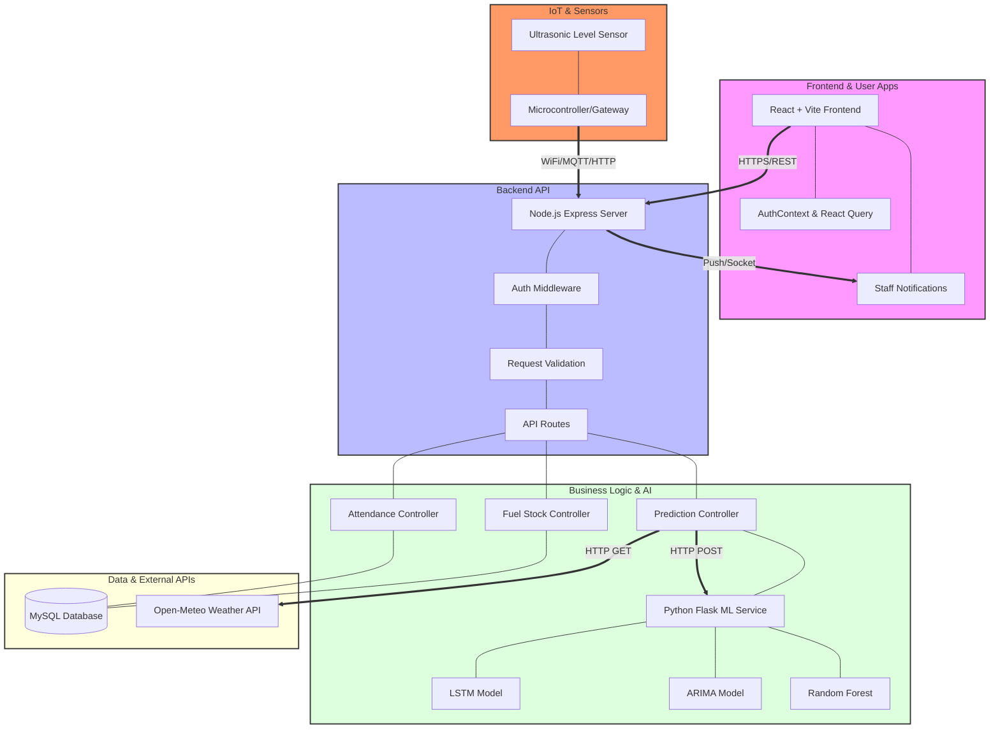

# FuelWatch: System Architecture

This document provides a high-level overview of the FuelWatch system architecture, including the core components, their interactions, and instructions for importing the visual diagram into Draw.io (diagrams.net).

## System Architecture Diagram (Mermaid)

Below is the Mermaid code for the system architecture. You can use this directly in Markdown viewers or import it into Draw.io.

## How to Import into Draw.io (diagrams.net)

To get a visual, editable version of this diagram in Draw.io:

1.  Go to [draw.io](https://app.diagrams.net/).
2.  Select **Create New Diagram** or **Open Existing Diagram**.
3.  In the top menu, go to **Arrange** > **Insert** > **Advanced** > **Mermaid...**.
4.  Copy and paste the Mermaid code block above into the text box.
5.  Click **Insert**.
6.  You can now drag, drop, and style the components as needed!

## Component Breakdown

### 1. IoT Layer (Sensors & Hardware)
- **Components**: Ultrasonic Level Sensor, Microcontroller (e.g., ESP32/Arduino).
- **Role**: Real-time monitoring of fuel levels in underground tanks. Sends raw data to the backend for processing and prediction.

### 2. Frontend (React + Vite)
- **Role**: Handles the user interface, employee dashboards, and manager views. Includes a notification module for staff alerts.
- **Tech Stack**: React, Vite, Framer Motion, React Query.

### 3. Backend (Node.js + Express)
- **Role**: The central orchestration layer. Receives data from IoT devices, manages notifications (via WebSockets or Push), and handles AI request routing.
- **Tech Stack**: Node.js, Express.js, JWT.

### 3. ML Service (Python + Flask)
- **Role**: Dedicated microservice for complex AI/ML calculations.
- **Tech Stack**: Python, Flask, TensorFlow, Scikit-learn.
- **Models**: Uses LSTM and ARIMA for time-series demand forecasting and Random Forest for staffing recommendations.

### 4. Database (MySQL)
- **Role**: Persistent storage for all structured data.
- **Schema**: Includes tables for Users, Employees, Attendance, Fuel Stocks, and Historical Demand.

### 5. External Integration (Open-Meteo)
- **Role**: Provides real-time weather data used to enrich AI predictions (e.g., weather's impact on fuel demand).
