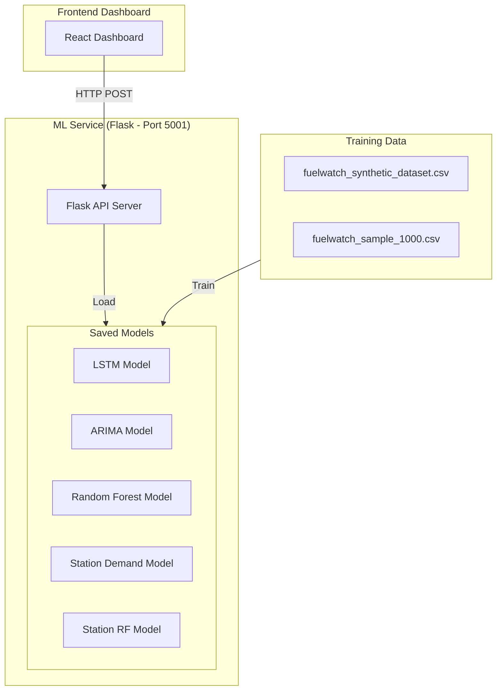
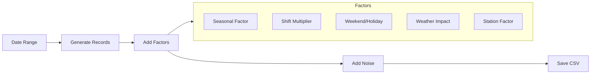
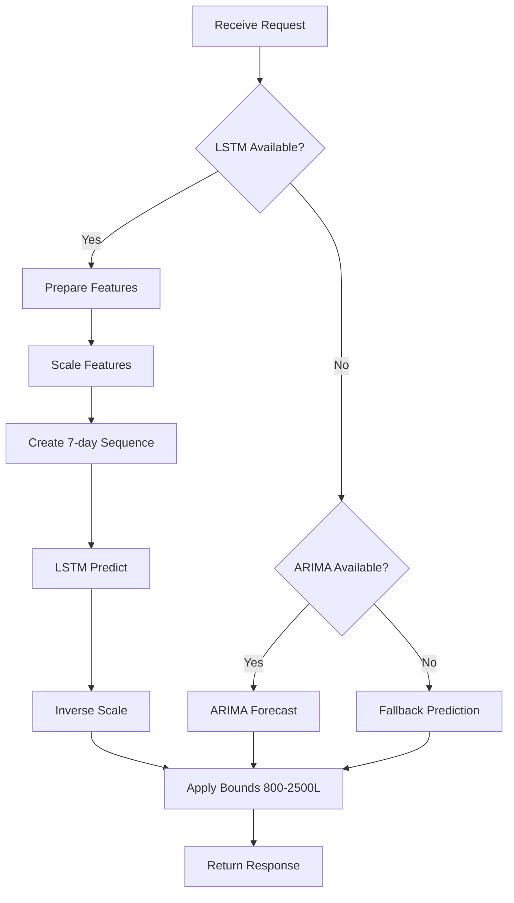
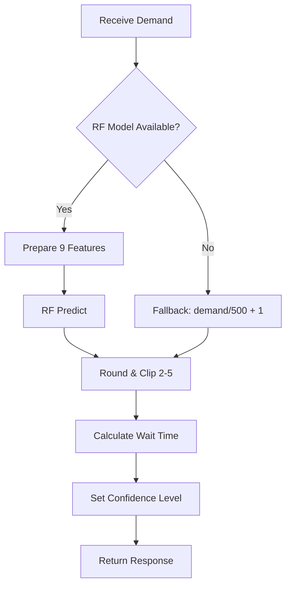
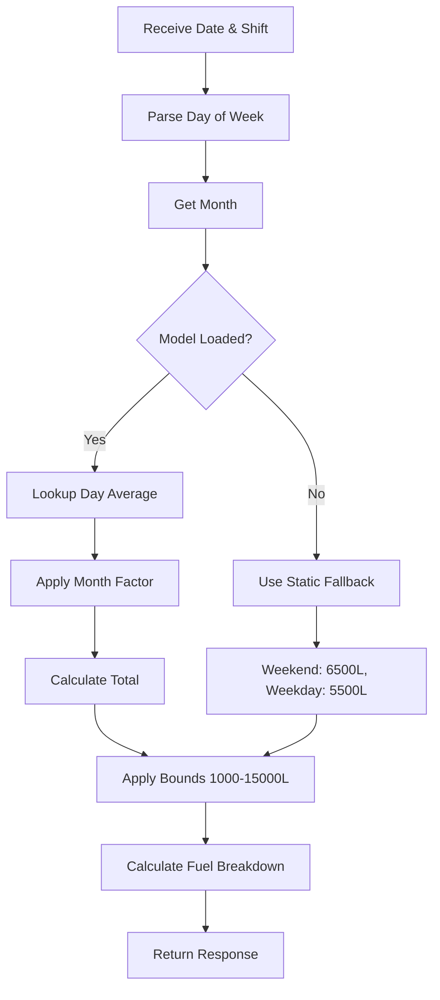
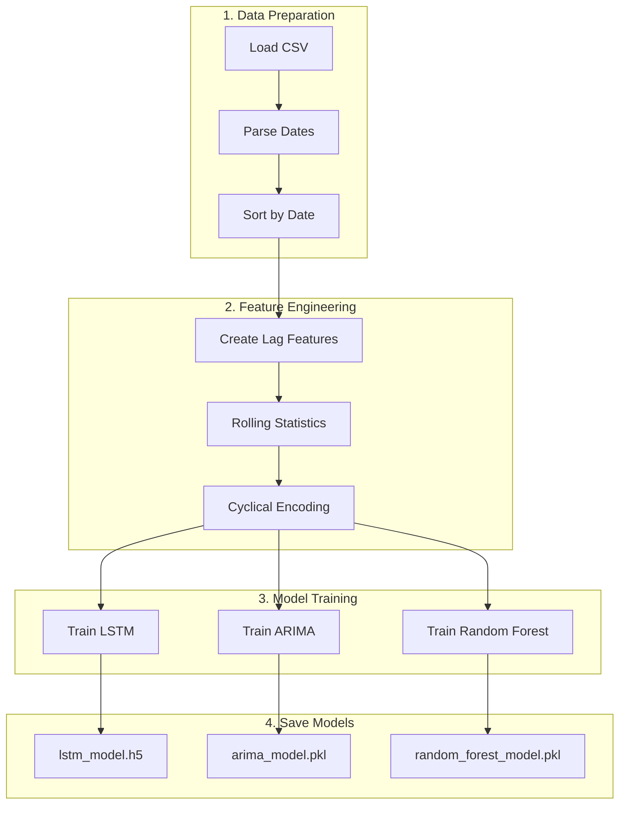

# FUELWATCH ML Prediction System - Complete Documentation

## Table of Contents
1. [System Overview](#system-overview)
2. [Architecture](#architecture)
3. [Models Used](#models-used)
4. [Data Pipeline](#data-pipeline)
5. [API Endpoints](#api-endpoints)
6. [Prediction Flow](#prediction-flow)
7. [Training Pipeline](#training-pipeline)
8. [Feature Engineering](#feature-engineering)

---

## System Overview

The FUELWATCH ML Service is a **Flask-based API** that provides intelligent demand forecasting and staffing recommendations for fuel stations. It uses multiple machine learning models to deliver accurate predictions.

### Key Capabilities
- **Fuel Demand Prediction** - Forecast daily/shift-based fuel demand
- **Staffing Recommendations** - Predict optimal staff allocation based on demand
- **Station Demand Analysis** - Total station-level demand forecasting
- **Batch Predictions** - Multi-day/shift forecasting in single request

---

## Architecture



### Technology Stack

| Component | Technology | Purpose |
|-----------|------------|---------|
| API Server | Flask + Flask-CORS | RESTful API endpoints |
| Deep Learning | TensorFlow/Keras | LSTM time-series model |
| Statistical ML | Statsmodels | ARIMA forecasting |
| Traditional ML | Scikit-learn | Random Forest models |
| Data Processing | Pandas, NumPy | Data manipulation |

---

## Models Used

### 1. LSTM Model (Deep Learning)
**Purpose:** Time-series demand forecasting

| Property | Value |
|----------|-------|
| File | `saved_models/lstm_model.h5` |
| Type | Sequential LSTM Network |
| Architecture | LSTM(128) → Dropout → LSTM(64) → Dropout → Dense(32) → Dense(1) |
| Sequence Length | 7 days lookback |
| Features Used | 11 features including lag variables |

**Input Features:**
- Day of week, Month, Is weekend, Is holiday
- Temperature, Rainfall
- Seasonal factor, Shift multiplier
- Demand lag (1-day, 7-day), Rolling mean (7-day)

---

### 2. ARIMA Model (Statistical)
**Purpose:** Statistical time-series demand forecasting

| Property | Value |
|----------|-------|
| File | `saved_models/arima_model.pkl` |
| Type | ARIMA (AutoRegressive Integrated Moving Average) |
| Parameters | (p=5, d=1, q=2) |
| Use Case | Fallback when LSTM unavailable |

**How it works:**
- Uses historical demand patterns
- Captures trend and seasonality
- Single-step forecasting

---

### 3. Random Forest Model (Staffing)
**Purpose:** Staff recommendation based on predicted demand

| Property | Value |
|----------|-------|
| File | `saved_models/random_forest_model.pkl` |
| Type | RandomForestRegressor |
| Estimators | 100 trees |
| Max Depth | 10 |
| Output Range | 2-5 staff members |

**Input Features (9 total):**
```python
['actual_demand_liters', 'num_transactions', 'avg_wait_time_minutes', 
 'day_of_week_num', 'is_weekend', 'is_holiday', 'shift_multiplier', 
 'temperature_celsius', 'seasonal_factor']
```

---

### 4. Station Demand Model (Historical Averages)
**Purpose:** Total station demand prediction

| Property | Value |
|----------|-------|
| File | `saved_models/station_demand_model.pkl` |
| Type | Lookup Table (Dictionary-based) |
| Method | Historical averages by day-of-week |
| Confidence | High (deterministic) |

**Prediction Method:**
1. Get base demand from day-of-week average
2. Apply monthly adjustment factor
3. Apply shift factor (morning=40%, afternoon=35%, evening=25%)

---

### 5. Station RF Model (Station Staffing)
**Purpose:** Station-level staffing prediction

| Property | Value |
|----------|-------|
| File | `saved_models/station_rf_model.pkl` |
| Type | RandomForestRegressor |
| Estimators | 100 trees |

---

## Data Pipeline

### Synthetic Dataset Generation



### Dataset Configuration

| Parameter | Value |
|-----------|-------|
| Date Range | 2022-01-01 to 2024-12-31 |
| Fuel Types | Petrol_92, Petrol_95, Diesel, Super_Diesel |
| Shifts | morning, afternoon, evening |
| Stations | Station_A through Station_E |
| Total Records | ~657,600 records |

### Key Multipliers

| Factor | Morning | Afternoon | Evening |
|--------|---------|-----------|---------|
| Shift Multiplier | 1.3 | 1.0 | 0.85 |

| Factor | Weekday | Weekend | Holiday |
|--------|---------|---------|---------|
| Day Multiplier | 1.0 | 1.25 | 1.6 |

---

## API Endpoints

### 1. POST `/predict-demand`
Predicts fuel demand for a specific date and shift.

**Request:**
```json
{
    "date": "2024-12-03",
    "shift": "morning",
    "fuel_type": "Petrol_92",   // optional
    "station_id": "Station_A"   // optional
}
```

**Response:**
```json
{
    "predicted_demand": 1650.25,
    "confidence": 0.88,
    "model": "LSTM v1.0",
    "date": "2024-12-03",
    "shift": "morning",
    "fuel_type": "Petrol_92",
    "station_id": "Station_A",
    "factors": {
        "seasonal_factor": 1.15,
        "shift_multiplier": 1.3,
        "is_weekend": false
    }
}
```

---

### 2. POST `/predict-staffing`
Predicts optimal staffing based on demand.

**Request:**
```json
{
    "predicted_demand": 1650,
    "date": "2024-12-03",      // optional
    "shift": "morning"         // optional
}
```

**Response:**
```json
{
    "recommended_staff": 4,
    "confidence": "high",
    "expected_wait_time": "5 minutes",
    "model": "Random Forest v1.0",
    "predicted_demand": 1650,
    "reasoning": {
        "base_rule": "1 staff per 500L demand",
        "minimum": 2,
        "maximum": 5,
        "demand_level": "high"
    }
}
```

---

### 3. POST `/predict-station-demand`
Predicts total station demand for a date/shift.

**Request:**
```json
{
    "date": "2024-12-03",
    "shift": "morning"
}
```

**Response:**
```json
{
    "total_predicted_demand": 6250,
    "breakdown": {
        "Petrol_92": 2625,
        "Petrol_95": 1125,
        "Diesel": 1750,
        "Super_Diesel": 750
    },
    "model": "Historical Average Model v2.0",
    "confidence": "high",
    "date": "2024-12-03",
    "shift": "morning",
    "day_of_week": 1
}
```

---

### 4. POST `/batch-predict`
Batch predictions for multiple dates/shifts.

**Request:**
```json
{
    "predictions": [
        {"date": "2024-12-03", "shift": "morning"},
        {"date": "2024-12-03", "shift": "afternoon"},
        {"date": "2024-12-04", "shift": "morning"}
    ]
}
```

**Response:**
```json
{
    "results": [
        {
            "date": "2024-12-03",
            "shift": "morning",
            "demand": { "predicted_demand": 1650, "confidence": 0.85 },
            "staffing": { "recommended_staff": 4, "confidence": "high" }
        }
        // ... more results
    ],
    "count": 3
}
```

---

### 5. GET `/health`
Health check endpoint.

**Response:**
```json
{
    "status": "healthy",
    "service": "FuelWatch ML Service",
    "version": "2.0.0",
    "models": {
        "lstm": true,
        "arima": true,
        "random_forest": true,
        "station_demand": true,
        "station_staffing": true
    },
    "models_count": 5,
    "timestamp": "2024-12-06T14:00:00.000Z"
}
```

---

### 6. GET `/models/info`
Get detailed model information.

---

### 7. POST `/models/reload`
Reload all models from disk.

---

## Prediction Flow

### Demand Prediction Flow



### Staffing Prediction Flow



### Station Demand Prediction Flow



---

## Training Pipeline

### Training Scripts

| Script | Purpose | Output |
|--------|---------|--------|
| `train_models.py` | Full training suite | All models |
| `train_demand_model.py` | Station demand model | `station_demand_model.pkl` |
| `train_station_model.py` | Station staffing model | `station_rf_model.pkl` |

### Training Process



### To Train Models

```bash
# Navigate to ml-service directory
cd ml-service

# Generate synthetic dataset (if not exists)
python generate_dataset.py

# Train all models
python train_models.py

# Train specific models
python train_demand_model.py    # Station demand
python train_station_model.py   # Station staffing
```

---

## Feature Engineering

### Lag Features
```python
demand_lag_1   = demand from 1 day ago
demand_lag_7   = demand from 7 days ago
demand_lag_30  = demand from 30 days ago
```

### Rolling Statistics
```python
demand_rolling_mean_7 = 7-day rolling average
demand_rolling_std_7  = 7-day rolling standard deviation
```

### Cyclical Encoding
```python
day_sin   = sin(2π × day_of_week / 7)
day_cos   = cos(2π × day_of_week / 7)
month_sin = sin(2π × month / 12)
month_cos = cos(2π × month / 12)
```

### Seasonal Factor
```python
seasonal_factor = 1 + 0.3 × sin(2π × (month - 1) / 12)
```

---

## Model Performance Metrics

| Model | MAE | RMSE | R² Score | MAPE |
|-------|-----|------|----------|------|
| LSTM | ~45L | ~58L | ~0.92 | ~3.5% |
| ARIMA | ~60L | ~78L | ~0.85 | ~4.8% |
| Random Forest (Staffing) | ~0.15 staff | ~0.22 staff | ~0.95 | N/A |

---

## Fallback Mechanisms

The system includes robust fallback predictions when models are unavailable:

### Demand Fallback
```python
base_demand = 1500
seasonal_factor = sin-based monthly adjustment
shift_multiplier = morning(1.3), afternoon(1.0), evening(0.85)
weekend_multiplier = 1.25 if weekend else 1.0
demand = base_demand × seasonal × shift × weekend + noise
```

### Staffing Fallback
```python
staff = max(2, min(5, int(demand / 500) + 1))
```

---

## Running the Service

```bash
# Start ML Service
cd ml-service
python app.py

# Service runs on http://localhost:5001

# Test health endpoint
curl http://localhost:5001/health

# Test demand prediction
curl -X POST http://localhost:5001/predict-demand \
  -H "Content-Type: application/json" \
  -d '{"date": "2024-12-06", "shift": "morning"}'
```

---

## File Structure

```
ml-service/
├── app.py                          # Main Flask API server
├── generate_dataset.py             # Synthetic data generator
├── train_models.py                 # Full training pipeline
├── train_demand_model.py           # Station demand training
├── train_station_model.py          # Station staffing training
├── test_ml_service.py              # API tests
├── requirements.txt                # Python dependencies
├── fuelwatch_synthetic_dataset.csv # Full dataset
├── fuelwatch_sample_1000.csv       # Sample dataset
├── dataset_summary.json            # Dataset metadata
├── ML_SETUP_GUIDE.md              # Setup instructions
└── saved_models/
    ├── lstm_model.h5              # LSTM model
    ├── lstm_scaler_X.pkl          # LSTM feature scaler
    ├── lstm_scaler_y.pkl          # LSTM target scaler
    ├── arima_model.pkl            # ARIMA model
    ├── random_forest_model.pkl    # RF staffing model
    ├── rf_features.pkl            # RF feature names
    ├── station_demand_model.pkl   # Historical averages model
    └── station_rf_model.pkl       # Station RF model
```

---

*Documentation generated: December 2024*
