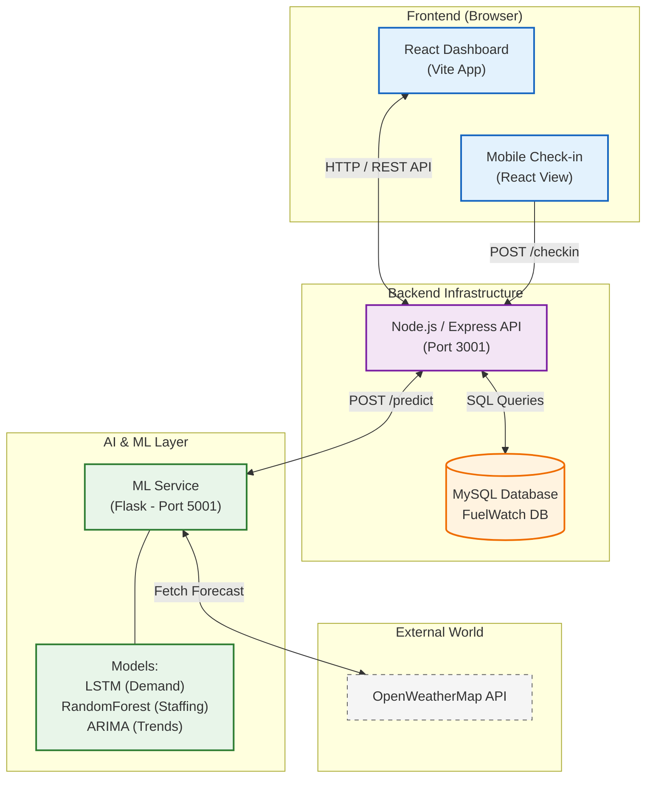

# System Overview Diagram Prompt

You can use the following prompt with any AI diagram generator (like ChatGPT, Lucidchart AI, or Eraser.io) or use the Mermaid code directly.

## 1. AI Prompt
> "Create a high-level system architecture diagram for 'FuelWatch', a fuel station management system.
> The system has 4 main blocks:
> 1. **Frontend (Client)**: A React-based Single Page Application (Vite) running in the browser. It handles User UI (Dashboard, Login, Staff Management) and a Mobile Check-in interface for employees.
> 2. **Backend API (Node.js/Express)**: The central REST API gateway (Port 3001). It handles authentication, employee management, fuel stock tracking, and attendance. It connects to a MySQL Database and forwards prediction requests to the ML Service.
> 3. **ML Service (Python/Flask)**: An independent AI service (Port 5001). It runs TensorFlow (LSTM), Scikit-learn (RandomForest), and ARIMA models to predict fuel demand and staffing needs. It also fetches weather data.
> 4. **Database (MySQL)**: Stores relational data (Users, Employees, Check-ins, Fuel Stocks).
> 5. **External APIs**: OpenWeatherMap API (fetched by ML Service).
>
> **Data Flow**:
> - Frontend sends HTTP requests to Backend API.
> - Backend queries/updates MySQL Database.
> - Backend sends 'Forecast Requests' to ML Service.
> - ML Service fetches Weather Data from External API.
> - ML Service returns 'Predictions' to Backend.
> - Backend serves 'Dashboard Data' (with predictions) to Frontend.
>
> **Style**: Clean, modern, cloud-architecture style. Use distinct icons for React, Node.js, Python, MySQL, and generic keys/clouds for APIs."

---

## 2. Mermaid Diagram Code
Copy and paste this into [Mermaid.live](https://mermaid.live/) or a Markdown viewer to visualize it.

